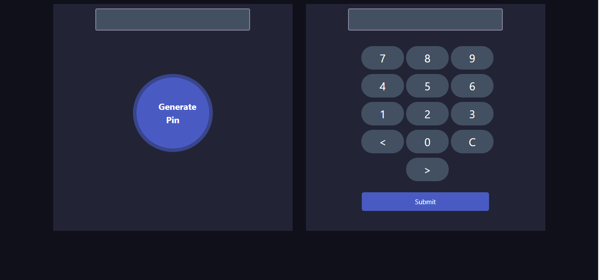

# Project:Pin Matcher
<h2>project features</h2>

In this project user generate a random pin number. User get three times to enter the generated pin number in the display. If they enter the pin accurately then they see the success message. If they don't enter the accurate pin number in three times. Then Pin submit button disable.

<h2>Project screenshot</h2>

#<h1><a href="https://jahidulbinrafiq.github.io/pin-matcher/">Live</a></h2>

 
